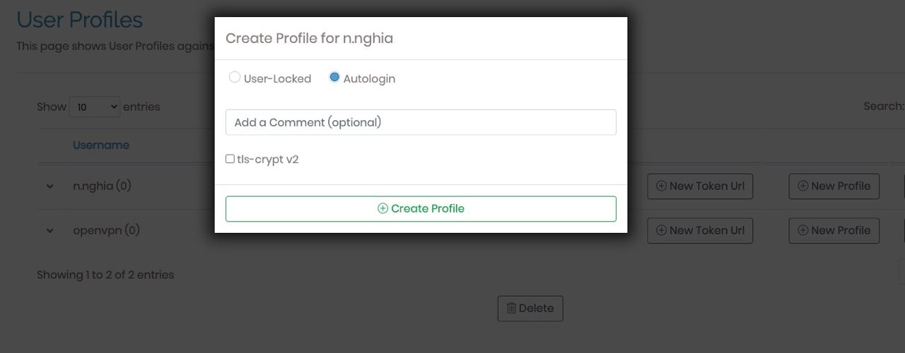

# How-to-made-openvpn-server-on-ubuntu
How-to-made-openvpn-server-on-ubuntu-linode

## Step 1: Go to the marketplace and choose open vpn

## Step 2: Choose ubuntu and 10$ for server

## Step 3: Enter password for limited user (optinal)

## Step 4: Enter root password of vps

## Step 5: After the vps install successful, go to ssh vps and do the following command

## Step 6: Go to /usr/local/openvpn_as

## Step 7: Open the file init and read password of openvpn from the log

## Set up and download project and happy vpn
URL : https://ip_vps:943 and open the port (80,443,943)

